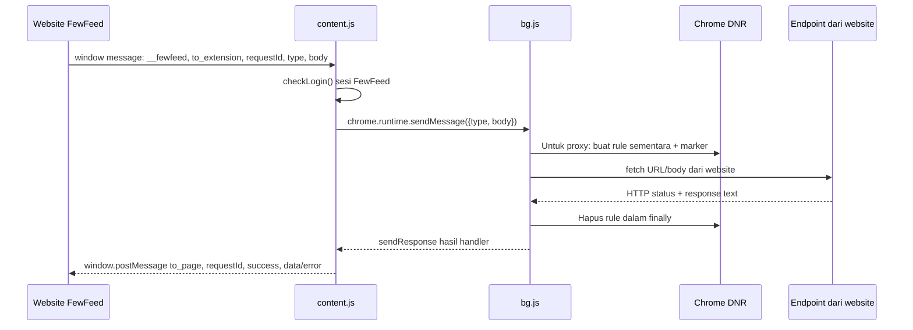

# Analisis statis FewFeed V3.9.3: Facebook One Card Link Image Post

Tanggal analisis: 13 September 2026. Cakupan: empat file lokal dalam `reference/FewFeedV3.9.3/`.

**Temuan utama: extension ini menyediakan bridge, pengaturan cookie/header, dan proxy HTTP generik. Implementasi bisnis One Card tidak ditemukan dalam empat file tersebut. Cara memperoleh `effective_object_story_id` setelah `POST /adcreatives` dan penyebab field tersebut tidak muncul pada test standalone belum ditemukan.** Tidak ada dasar untuk memilih mekanisme A–E dari source ini.

Analisis selesai untuk artefak yang tersedia; rekonstruksi transaksi One Card lengkap masih membutuhkan source pemanggil di website. Dugaan bahwa orchestration berada di website atau backend website adalah inferensi dari kontrak proxy, bukan hasil pemeriksaan source website.

## 1. Metode, cakupan, dan batas bukti

- Seluruh `manifest.json` dan `inject.js` dibaca; seluruh AST `content.js` dan `bg.js` diparse, string lookup didecode, konstanta digabung, lalu entry point, handler, dan fungsi pendukung ditelusuri.
- Tidak menjalankan extension, browser, source obfuscated, atau fungsi publishing. Tidak melakukan request jaringan, login, membaca cookie browser, maupun mengakses credential/session aktual.
- Helper hanya membaca source sebagai teks. Interpreter ekspresi terbatas menangani literal, aritmetika, dan wrapper decoder satu-return; tidak menggunakan `eval`, `Function`, `vm`, atau import terhadap source extension.
- Decoder base64 dengan alfabet khusus dan RC4 ditulis ulang sebagai transformasi data. Rotasi tabel ditemukan melalui checksum aritmetika, dengan percobaan dibatasi panjang tabel. Loop bootstrap asli dan anti-debugging tidak dijalankan.
- Output `.decoded.txt` adalah bahan baca, **bukan program yang boleh dijalankan**. Nama variabel obfuscated, fungsi wrapper, dan dead code sengaja masih dipertahankan. Tabel serta fungsi decoder dan bootstrap rotasinya tidak dicetak ulang.
- Cabang konstan dibaca manual: contoh `x !== x` selalu salah dan perbandingan dua string tetap menentukan cabang aktif. Teks di cabang mati tidak dianggap transaksi nyata.
- Nama field session di laporan adalah nama skema, bukan nilainya. Tidak ada capture request/response atau credential pengguna.
- Tidak ada penelusuran dokumentasi online Meta. Klasifikasi API di bawah menggambarkan source lokal, bukan verifikasi dukungan API Meta saat ini.

Reproduksi offline dari root repository, memakai dependensi Babel yang sudah terpasang:

```text
node scripts/research/decode-fewfeed.cjs
```

| File | Entri tabel | Rotasi kiri | Call lookup diganti |
| --- | ---: | ---: | ---: |
| content.js | 1230 | 148 | 1293 |
| bg.js | 2797 | 208 | 3337 |

Pemeriksaan hasil: tidak tersisa call identifier `_0x…` berargumen dua literal yang menjadi kandidat lookup belum terurai. Ini bukan klaim pembuktian formal seluruh perilaku runtime; source masih menerima URL dan payload dinamis.

SHA-256 source yang dianalisis:

```text
content.js    cf3424ec402fe863566ffefffe1faed8792c366819217535a7e41b73e8adf016
bg.js         a21172337e781cdafb2c10c181b9cb41cd53c1b201f13a3e42181bce6e8b154b
inject.js     5123acdf7953487d6c9b8b52012178a04629fb4bf7bf1d07a3e35a0ee6c0c8b1
manifest.json 7fcab23b2256eae183a0d60915fd9edf3772411636836cf2cfba792fcdb41e2e
```

## 2. Arsitektur extension

Manifest menggunakan Manifest V3; `version` bernilai `9.3`, sementara description menyebut FewFeed V3.9.3. Service worker adalah `bg.js`.

| Komponen | World / waktu | Tanggung jawab yang terlihat |
| --- | --- | --- |
| Website FewFeed | JavaScript website; source tidak disertakan | Menentukan aksi produk dan menyediakan URL, method, body, headers atau entri file ke bridge |
| inject.js | `MAIN`, `document_start`, semua frame yang cocok | Menandai extension terpasang; memodifikasi fetch/XHR/FormData dan parsing respons photo/video |
| content.js | Isolated world default; waktu default karena `run_at` tidak diisi; semua frame yang cocok | Mengecek sesi FewFeed, menghubungkan DOM dan window messages dengan runtime messaging |
| bg.js | Service worker | Menyiapkan DNR, menangani cookie/header, menjalankan dua proxy HTTP generik |

Content scripts hanya cocok dengan `https://fewfeed.app/*` dan `https://fewfeed.online/*`. Manifest tidak memasukkan content script di halaman Facebook. Host permission `*://*/*` sangat luas. Permission: `declarativeNetRequest`, `declarativeNetRequestFeedback`, `declarativeNetRequestWithHostAccess`, `cookies`, `tabs`, `storage`, `scripting`. Deklarasi permission tidak berarti semuanya dipakai: tidak ditemukan pemanggilan `chrome.storage` atau `chrome.scripting` pada hasil decode.

`bg.js` juga mempunyai bootstrap anti-tamper/penyembunyian console dan `content.js` mempunyai boilerplate serupa dalam `waitForElement`. Bagian ini tidak memuat orchestration creative. `content.js` memakai MutationObserver untuk menghapus elemen `.fixed.inset-0.z-50` dan `.fixed.inset-0.z-40`, lalu memulihkan overflow body. Ini manipulasi UI website, bukan publishing.

## 3. Website ↔ content.js ↔ bg.js



Diagram menunjukkan alur yang didukung source, **bukan bukti One Card menggunakan proxy ini untuk setiap request**. Ada jalur kedua: website dapat memakai fetch/XHR langsung, `inject.js` memodifikasi request di main world dan DNR memodifikasi header tanpa `chrome.runtime.sendMessage` per request.

### Bridge window message

Bukti: [content.decoded.txt](../scripts/research/content.decoded.txt), listener `window.addEventListener("message", ...)`, mulai baris 1462.

1. Listener mengabaikan pesan tanpa `data`, tanpa `data.__fewfeed`, atau dengan `direction` selain `to_extension`.
2. Mengambil `requestId`, `type`, dan `body` dari `event.data`.
3. Menjalankan `checkLogin()`. Ini mengecek `/api/auth/session` pada origin FewFeed; respons JSON harus memiliki `user.email`. Hasil dicache melalui `isAuthChecked`/`isFewFeedUser`. Ini bukan verifikasi token Meta.
4. Jika gagal autentikasi FewFeed, mengirim envelope `to_page` dengan `success:false` dan pesan error.
5. Jika lolos, meneruskan `{type, body}` tanpa mengonstruksi payload Graph/GraphQL.
6. Callback runtime menolak Promise jika ada `chrome.runtime.lastError`; selain itu hasil handler menjadi `data` envelope.
7. Mengirim `window.postMessage(..., '*')`, menyertakan `__fewfeed:true`, `direction:'to_page'`, dan `requestId` yang sama.

Tidak ditemukan pemeriksaan `event.origin`, `event.source`, allowlist `type`, atau skema `body` pada listener ini. Tidak ada `chrome.runtime.onMessage` di `content.js`: balasan diterima lewat callback `sendMessage`. `inject.js` sendiri tidak mengirim `window.postMessage`; producer pesan berasal dari luar empat file ini.

**Dua lapisan status:** `success:true` pada envelope content hanya berarti callback runtime diterima. `data.success:true` pada proxy berarti fetch dan pembacaan teks selesai, meskipun HTTP 400/500. Proxy tidak memeriksa `response.ok`, error JSON Meta, atau keberadaan story ID. Type tidak dikenal dapat menghasilkan envelope sukses dengan `data:null`.

### Bridge DOM lama

`waitForElement(selector)` mencari elemen langsung atau menunggu MutationObserver. Observer ini bukan polling status creative.

| Trigger | Message / perilaku |
| --- | --- |
| Setelah `checkLogin()` awal lolos | `INIT_SET_COOKIE`; hasil disimpan sebagai data sesi di storage/cookie website |
| Klik `#fewfeed-add-login` | `LOGIN_NEW_ACC` |
| Klik `#fewfeed-reels-wipe` | `WIPE_REELS`, body `{}` |
| Klik `#fewfeed-accounts-add` | `SET_MULTIPLE_HEADER`, body dari `.value` elemen |
| Klik `#fewfeed-reel-add` | `SET_REEL_DATA`, body dari `.value` elemen |
| Klik `#fewfeed-cookie-add` | Handler kosong; tidak mengirim message |
| Klik `#fewfeed-click` | `SET_RAW_COOKIE`, body dari key localStorage `main_cookie` atau string kosong |

Beberapa callback mengisi `.value` dan memicu `keyup` dengan `bubbles:true`, `cancelable:false` agar website membaca hasil. Jalur init menyimpan objek `fewfeed` dengan `version:11`, key `fb_cookies`, dan cookie website `fb_proxy_cookies`; callback `#fewfeed-click` menyimpan objek `fewfeed` dengan `version:2`. Angka ini konstanta kontrak storage, bukan Graph API version. Tidak ada nilainya yang dibaca saat penelitian.

## 4. Seluruh message type content ↔ background

Bukti definitif: [bg.decoded.txt](../scripts/research/bg.decoded.txt), `chrome.runtime.onMessage.addListener`, baris 2084–2170. Terdapat **8 case**. Duplikasi switch di cabang mati `setCookieHeader` bukan dispatcher tambahan.

`C` = literal pengirim aktif di content; `W` = dapat diteruskan generic window bridge. Tidak ada message bernama `setCookieHeader` atau `setCookieHeaderTargetID`; keduanya helper internal.

| Type | Asal | Fungsi tujuan | Input body | Tujuan dan output |
| --- | --- | --- | --- | --- |
| `INIT_SET_COOKIE` | C/W | `initSetCookie()` | Diabaikan / tidak perlu body | Mengambil cookie Facebook melalui Chrome, mengisi state UID/cookie, memasang dua rule cookie. Mengembalikan string cookie atau `''` jika cookie/UID tidak tersedia |
| `SET_REEL_DATA` | C/W | `setReelData(body)` | Objek atau JSON string: `vid`, `offset`, `file_size`, `end_offset`, `x_fb_video_waterfall_id`, `name`, `bz` | Mengatur dua rule header upload video; `bz` didestructure tetapi tidak dipakai. Output `''` |
| `WIPE_REELS` | C/W | `wipeReels()` | Diabaikan; DOM mengirim `{}` | Menghapus rule yang regex-nya berawalan `reel_video=` atau `wall_reel_id=`; output `''`. Bukan menghapus posting Reel di Meta |
| `SET_MULTIPLE_HEADER` | C/W | `setMultipleHeader(body)` | Objek/JSON string; array `{id,cookie}` atau objek `{uid,cookie}` | Memasang rule cookie per identifier via `setCookieHeaderTargetID`; output `''`, termasuk input tanpa bentuk yang didukung |
| `SET_RAW_COOKIE` | C/W | `setRawCookie(body)` | Raw string, JSON string berisi string atau `{main_cookie}`, atau objek `{main_cookie}` | Memperbarui state, mencoba menulis cookie browser, memasang rule global/per UID. Output string hasil normalisasi atau `''` untuk input tidak valid |
| `LOGIN_NEW_ACC` | C/W | `loginNewAcc()` | Diabaikan | Mencoba menghapus beberapa cookie login dan membuka tab Facebook. Dispatcher segera membalas `'OK'` tanpa menunggu selesai |
| `PROXY_UPLOAD` | W | `swProxyUpload(body)` | `{url, formDataEntries, headers}` | Multipart POST generik; output `{success:true,data:<response text>,status}` atau `{success:false,error}` |
| `PROXY_FETCH` | W | `swProxyFetch(body)` | `{url, method, body, bodyType, headers}` | Fetch generik, default method `POST`; output sama dengan proxy upload |

Semua case async selain `LOGIN_NEW_ACC` mengembalikan `true` dari listener untuk mempertahankan channel callback, lalu `.then(sendResponse)`. Unknown type membalas `null` dan mengembalikan `false`. Tidak ada `.catch` menyeluruh pada dispatcher; kegagalan sebelum blok `try` proxy atau parsing input dapat membuat kontrak error berbeda dari error fetch yang tertangkap.

## 5. Cookie dan header: fungsi yang relevan

Deskripsi berikut hanya perilaku source, tidak dilakukan dalam penelitian.

- `initSetCookie`: `chrome.cookies.getAll({domain:'facebook.com'})`; menyusun string cookie, mengambil identifier dari nama cookie pengguna, lalu memanggil `setCookieHeader` dan `setCookieHeaderTargetID`. State `currentCookieStr` dan `currentUID` awalnya string kosong.
- `setRawCookie`: menormalisasi bentuk input; memecah pasangan pada titik koma; mencoba `chrome.cookies.set` untuk domain Facebook dengan `secure:true`. Error per cookie ditelan. Memasang rule tetap dilanjutkan; string hasil bukan bukti setiap cookie berhasil ditulis.
- `setCookieHeader(cookieString)`: dynamic rule ID **111**, priority 1, regex `facebook\.com`, initiator `DOMAINS`; menyetel header Cookie. Menangkap error pemasangan rule tetapi kemudian masih mencetak log sukses.
- `setCookieHeaderTargetID(identifier,cookieString)`: ID rule dari 8 karakter terakhir identifier yang diparse sebagai angka; regex `fewfeed_fb_id=<identifier>`; priority 1; Cookie diganti pada request yang cocok. Identifier tersebut bukan story ID yang ditemukan extension; caller menyediakannya.
- `setMultipleHeader`: memakai helper per identifier, tidak membuat arbitrary header set meskipun nama message terdengar umum.
- `createProxyDnrRule(headers)`: counter awal 60000, membuat marker `__fwp=<ruleId>`, rule priority 10 yang mencocokkan marker, lalu menambahkan marker ke URL request. Ini **temporary DNR rule**, bukan temporary campaign/adset/ad.
- Rule proxy menyetel Cookie dari `currentCookieStr`, Origin/Referer Business Facebook, serta Sec-Fetch-Site/Mode/Dest. Header tambahan caller diubah menjadi string; Cookie, Origin, Referer dan semua prefix `sec-fetch` dari caller dilewati. Jadi header Cookie caller tidak mengganti state cookie proxy.
- `cleanupProxyRule(ruleId)` menghapus rule dalam `finally`; error cleanup ditelan. Rule proxy tidak membatasi domain tujuan atau initiator di condition, hanya marker dan resource types.

Pada `runtime.onInstalled`, worker mengambil dan menghapus rule dinamis yang ada, kemudian memasang salinan rule dasar per origin FewFeed. Ada 14 template subdomain dan 8 template marker, masing-masing digandakan untuk `.app` dan `.online` menjadi 44 rule. Walau variabel bernama `ALL_STATIC_RULES`, pemasangan memakai **updateDynamicRules**, bukan ruleset statis manifest. Untuk rule dasar yang memakai Allow-Credentials, wildcard Allow-Origin disesuaikan ke origin FewFeed masing-masing.

Marker lain: `fewfeed_urlencoded` menyetel Content-Type URL-encoded; `fewfeedcors=0` mengubah header CORS/Origin/Referer; `fewfeed_empty` menghapus Cookie; `killagent=0` memakai User-Agent tetap; `global_scope_id` mengubah fetch metadata. Kehadiran marker ini tidak menunjukkan payload creative atau mutation tertentu.

## 6. Bagaimana image diupload

**Yang terbukti hanya serializer upload generik**, pada `swProxyUpload` (decoded baris 1917–2008):

1. Caller menyediakan `url` dan `formDataEntries`; extension tidak memilih endpoint image.
2. Setiap entry `type:'file'` berisi `name`, `data` berupa byte array, opsional `mimeType` dan `fileName`.
3. Worker membuat `Uint8Array(data)`, lalu `Blob`; default MIME `application/octet-stream`, default nama file `file`.
4. File ditambahkan ke FormData menggunakan nama field caller. Entry lain ditambahkan sebagai pasangan `name`/`value`.
5. Fetch melakukan POST multipart. Boundary dibentuk FormData/fetch; worker tidak memiliki konstanta nama field image Marketing API.
6. Respons dibaca dengan `.text()` dan diteruskan utuh; tidak mengekstrak image hash, image ID, creative ID, atau story ID.

Ada patch khusus jika URL mengandung `upload-business.facebook.com`, tidak mengandung nama field `jazoest`, tetapi memiliki parameter `fb_dtsg`: helper menambahkan parameter turunan tersebut. Laporan tidak menyertakan nilai atau contoh session.

`swProxyFetch` juga mendukung body biner: bila `bodyType === 'arraybuffer'`, byte array dikonversi menjadi `Uint8Array(...).buffer`; body lain diteruskan apa adanya, dan body falsy menjadi `null`. Fungsi ini tidak otomatis melakukan JSON.stringify atau URL encoding.

**Tidak ditemukan** `/adimages`, pemilihan account image library, base64 image Marketing API, atau pengolahan respons `images[...].hash`. Tidak dapat menyatakan One Card menggunakan Marketing API adimages hanya dari dukungan Blob/FormData.

## 7. Peran inject.js

Bukti: [inject.js](../reference/FewFeedV3.9.3/inject.js), file sudah readable.

- Baris 1: `window.fewfeed = {installed:true}`.
- Baris 3–23: membungkus `Response.prototype.json`. Untuk URL yang cocok `graph.facebook.com/.../(photos|videos)`, membaca clone sebagai teks dan mencoba JSON.parse. Jika parsing gagal, mengembalikan objek dengan **ID sintetis** berprefix `waf_` untuk `id` dan `post_id`.
- ID sintetis itu bukan ID Meta dan bukan `effective_object_story_id`. Regex tidak mencakup `/adcreatives`; source ini tidak membuktikan bahwa fallback tersebut menyebabkan field hilang pada test standalone.
- `processBody` hanya memodifikasi FormData: merapikan spasi nama field; mengingat target dari `target_id`/`av`; mencatat konteks composer; mengubah `source` untuk konteks selain group; memperbaiki bentuk waterfall identifier; menambahkan field session/helper yang belum ada. Tidak membangun `object_story_spec`/`link_data`.
- `getUID` membaca cookie milik halaman FewFeed atau localStorage pada runtime extension. Penelitian hanya membaca definisinya, tidak sumber data browser.
- Wrapper XHR/fetch memperbaiki target undefined pada URL. Konteks group membedakan nama parameter video; XHR upload group menambahkan Offset dan Entity headers.
- `/ajax/video/upload/requests/start` mereset konteks upload. Path `/fb_video/`, parameter `reel_video`, `wall_reel_id`, `video_id` adalah petunjuk video/group/reel, bukan flow One Card image.
- Tidak ada publisher, scheduler, GraphQL client, atau sender window message di file ini.

## 8. Flow One Card: langkah yang terbukti vs belum tersedia

| Tahap fitur | Yang tersedia dalam extension | Status bukti One Card |
| --- | --- | --- |
| Pilih Page, ad account, link, caption, image | Tidak ada model/UI One Card | Belum diketahui; kemungkinan website |
| Menyiapkan transport/session | Bridge dan cookie/header helpers | Terbukti sebagai kemampuan umum |
| Upload image | Generic multipart/binary proxy | Endpoint, field, dan output image One Card belum diketahui |
| Membuat creative | URL/body bebas dapat diteruskan | Tidak ada POST `/adcreatives` atau pembangun spec |
| Mendapatkan story ID | Respons proxy dikembalikan sebagai teks | Tidak ada ekstraksi atau lookup `effective_object_story_id` |
| Membuat temporary campaign/adset/ad | Tidak ada fungsi/endpoint terkait | Tidak teridentifikasi |
| Publish post | Tidak ada aksi Page/story khusus | Tidak diketahui endpoint, method, dan payload |
| Schedule post | Tidak ada scheduler atau field waktu publish | Tidak diketahui apakah dilakukan website, backend, atau Meta |
| Menampilkan hasil | Bridge mengembalikan envelope hasil | Parsing dan UI website tidak tersedia |

Urutan maksimal yang dapat direkonstruksi: website menyiapkan request yang belum diketahui → content memeriksa sesi FewFeed → runtime message → worker proxy → endpoint yang ditentukan caller → response text → callback content → window response website. **Tidak ada dasar untuk menyisipkan create-Ad, polling, GraphQL, atau publish sebagai langkah faktual di tengah urutan ini.**

## 9. Endpoint, API resmi, dan internal/session

| Host / path / pola di source | Penggunaan yang terbukti | Batas interpretasi |
| --- | --- | --- |
| FewFeed `/api/auth/session` | fetch pemeriksaan sesi website dari content | Bukan endpoint Meta |
| `graph.facebook.com` | Filter DNR Origin/Referer/CORS | Domain Graph API resmi; tidak membuktikan Marketing API dipanggil |
| `graph.facebook.com/.../(photos|videos)` | Filter hook parsing respons inject | Pola respons Graph, bukan pemanggilan endpoint publishing di extension |
| `upload-business.facebook.com` | Rule header/CORS dan patch parameter upload | Upload berbasis session; path aktual caller tidak diketahui |
| `up.facebook.com` dengan `wall_reel_id` | Rule upload video | Flow video, bukan bukti One Card |
| `/ajax/video/upload/requests/start`, `/fb_video/` | Pencocokan/patch URL inject | Internal web upload; URL penuh tidak dibangun di sini |
| `business.facebook.com/creatorstudio/published?content_table=POSTED_POSTS&post_type=FB_SHORTS` | Nilai header Referer | Bukan request query post oleh worker |
| `www.facebook.com` | Target tab login, cookie API, header Origin/Referer | Bukan endpoint GraphQL yang dapat disimpulkan dari host saja |
| `m`, `web`, `mobile`, `mbasic`, `business`, `en-gb`, `upload`, `free`, `adsmanager` subdomain Facebook | Template header domain | Tidak ada operasi bisnis spesifik yang dapat diturunkan |
| TikTok | Rule header tambahan | Di luar One Card; dicatat demi cakupan penuh bg.js |

Bagian yang berhubungan dengan API resmi: routing/filter ke domain Graph dan hook respons photos/videos. **Tidak ditemukan implementasi operasi resmi Marketing API adimages/adcreatives di empat file ini.**

Bagian internal/session: Chrome cookies, Cookie injection via DNR, peniruan Origin/Referer/Sec-Fetch, parameter form session, endpoint upload web/video, dan referer Creator Studio. Dukungan internal/session umum ini tidak membuktikan bahwa One Card menggunakan internal GraphQL.

### GraphQL

Pada source readable/hasil decode tidak ditemukan `graphql`, `/api/graphql`, `doc_id`, `fb_api_req_friendly_name`, `object_story_spec`, `link_data`, atau `effective_object_story_id`. Tidak ditemukan operation name atau variables template yang dapat dikaitkan dengan GraphQL.

Karena proxy menerima URL/body dari luar, GraphQL tetap **mungkin** dibawa sebagai payload runtime. Endpoint lengkap, nama operasi, doc_id hardcoded, struktur variables, dan tujuan mutation/query **tidak dapat diidentifikasi**. Tidak boleh mengisi kekosongan ini dengan doc_id/operasi dari versi FewFeed atau produk lain.

## 10. Jawaban khusus: setelah POST /adcreatives, bagaimana story ID diperoleh?

**Belum diketahui dari artefak yang disediakan.** Bahkan langkah POST `/adcreatives` tidak terdapat dalam implementasi extension ini.

| Hipotesis | Hasil pemeriksaan |
| --- | --- |
| A. Langsung dari creative | Tidak ada pembacaan field creative atau `fields=effective_object_story_id` |
| B. Membuat Ad | Tidak ada konstruksi Ad atau endpoint `/ads` |
| C. Polling | Tidak ada loop retry/timer yang memeriksa creative/story. MutationObserver menunggu DOM, bukan API |
| D. Endpoint lain | Proxy mendukung URL arbitrer, tetapi URL story lookup tidak disertakan |
| E. Internal GraphQL | Tidak ada operasi, doc_id, atau variables yang mengidentifikasi mekanisme tersebut |
| Mekanisme lain | Respons dikirim utuh ke website; pemrosesan berikutnya tidak tersedia |

Tidak ditemukan temporary campaign/adset/ad, unpublished Page post, ataupun scheduled Page post. Ini berarti **tidak ada bukti dalam empat file**, bukan pembuktian bahwa fitur website tidak menggunakan mekanisme tersebut.

**Penyebab `effective_object_story_id` tidak muncul pada test standalone adcreative kita belum ditemukan.** Payload, field selection, respons, dan urutan test tersebut bukan bagian dari empat file yang dianalisis. Tidak dapat menyimpulkan bahwa harus membuat Ad, menunggu materialisasi, memakai session tertentu, atau melakukan GraphQL. Menyalin cookie/header extension juga tidak memiliki dasar sebagai solusi masalah field tersebut.

## 11. Publish dan scheduling

Tidak ada fungsi pembangun request publish Page/story. Tidak ditemukan `published`, `unpublished`, `scheduled_publish_time`, `is_published`, atau mekanisme scheduler yang mengatur post di hasil decode. Path `creatorstudio/published` hanya Referer video. Hook `post_id` pada inject hanya pemrosesan hasil, bukan langkah publish.

Tidak ada alarm Chrome, timer penjadwalan post, persistensi antrean, polling creative, atau retry publishing. Untuk memastikan publish/schedule dibutuhkan source website yang membangun request dan memproses hasil, termasuk kemungkinan server-side action. Penelitian ini tidak mengambil source tersebut dari jaringan.

## 12. Risiko dan ketergantungan teknis yang terlihat

1. **Batas observabilitas:** extension adalah transport generik. Menyamakan dukungan proxy dengan implementasi One Card akan menghasilkan rekonstruksi yang tidak terbukti.
2. **Sukses transport bukan sukses Meta:** dua lapisan `success`, respons HTTP error tetap dinyatakan sukses proxy, dan fallback `waf_` photo/video berpotensi memberi kesan posting berhasil padahal ID bukan dari server.
3. **State session volatil:** cookie/UID dan counter proxy berupa variabel worker, tanpa pemulihan melalui chrome.storage yang terlihat. DNR dinamis dapat tetap ada sementara state worker diinisialisasi ulang. Analisis tidak menguji perilaku runtime ini.
4. **Rule dan cleanup:** ID dari potongan identifier berpotensi bentrok. `wipeReels` mencari prefix `wall_reel_id=`, sementara rule kedua `setReelData` dimulai `up\\.facebook\\.com/.*wall_reel_id=`; secara string rule kedua tidak cocok filter wipe tersebut.
5. **Boundary pesan/URL:** window bridge tidak memeriksa source/origin; proxy menerima URL tanpa allowlist dan rule marker membawa Cookie state. Ini trust boundary yang luas di source, bukan uji eksploitasi.
6. **Error handling tidak seragam:** pemasangan rule dan konstruksi body berlangsung sebelum `try` fetch; beberapa error ditelan; dispatcher tidak menangkap semua rejected Promise. `'OK'` login dikirim sebelum pekerjaan selesai.
7. **Ketergantungan private web flow:** DOM selectors, URL upload internal, form session, header spoofing, dan referer Creator Studio bergantung pada perilaku website/browser yang dapat berubah.
8. **Hook global:** patch prototype berlaku luas di main world. FormData non-One-Card ikut dimodifikasi. Tidak ada bukti bahwa modifikasi tersebut dibutuhkan One Card.
9. **Sesi FewFeed dicache:** hasil gagal pertama `checkLogin` tetap cached pada instance content. DOM handlers tidak semuanya memanggil gate checkLogin yang sama dengan generic window bridge.
10. **Scope izin luas:** host permission semua host dan penggunaan cookie/marker DNR perlu dipahami jika kelak merancang solusi; source ini tidak cukup sebagai spesifikasi minimum publishing.

## 13. Kesimpulan bagian minimum yang harus dibuat ulang

Belum dapat menentukan algoritme minimum One Card yang setara FewFeed dari extension ini. Yang diketahui hanya kontrak transport, bukan urutan upload → creative → story → publish/schedule.

Untuk rancangan kelak, bagian konseptual minimum yang harus diidentifikasi adalah input One Card, upload image dan identitas hasilnya, create creative dan spesifikasinya, resolusi story ID, publish/schedule, serta validasi respons dan error. **Ini daftar kebutuhan analisis, bukan implementasi yang terbukti dilakukan FewFeed.** Reels/group video, manipulasi overlay UI, dan fallback ID `waf_` tidak memiliki bukti sebagai kebutuhan One Card.

Artefak lanjutan yang dapat menjawab gap adalah salinan lokal source/bundle website yang memuat pemanggil `PROXY_FETCH`/`PROXY_UPLOAD` atau fetch Graph langsung, terutama kode sekitar `adcreatives`, `effective_object_story_id`, dan publish/schedule. Jika ada source test standalone lokal, perbandingan payload yang sudah disanitasi dapat dilakukan terpisah. Tidak diperlukan login atau credential untuk analisis source tersebut.

## 14. Indeks bukti untuk review

Nomor baris mengacu ke hasil decode deterministik dari helper saat ini. Source content/bg asli minified pada satu baris; offset di bawah adalah posisi karakter AST Babel, zero-based, end-exclusive.

| Area | Hasil decode / source | Lokasi source asli |
| --- | --- | --- |
| Sesi FewFeed dan init | content decoded 45–347 | `checkLogin`: `[8154,14143)`; init `[14143,21343)` |
| DOM observer/helper | content decoded 352–899 | `waitForElement`: `[21508,45019)` |
| DOM handlers | content decoded 906–1461 | Statements `[45188,66160)` dan awal `[66243,82560)` |
| Window bridge | content decoded 1462–1695 | Bagian statement `[66243,82560)` |
| Rule dasar dan instalasi | bg decoded 304–701 | Sebelum `setCookieHeader`, termasuk install `[107963,109930)` |
| Cookie global / targeted | bg decoded 705 / 855 | `[109968,117642)` / `[117642,120878)` |
| Init cookie | bg decoded 924 | `[120878,128610)` |
| Reel / wipe | bg decoded 1107 / 1343 | `[128663,139329)` / `[139329,141995)` |
| Multiple / raw cookie | bg decoded 1382 / 1497 | `[141995,148069)` / `[148069,156591)` |
| Login / parameter helper | bg decoded 1642 / 1697 | `[156591,158843)` / `[158843,160385)` |
| Proxy DNR / cleanup | bg decoded 1737 / 1873 | `[160438,168002)` / `[168002,169916)` |
| Upload / fetch | bg decoded 1917 / 2009 | `[169916,174518)` / `[174518,177786)` |
| Runtime dispatcher / action | bg decoded 2084–akhir | Statement `[177786,182579)` |
| Hook photos/videos dan request | inject.js seluruh file | Source readable; tidak memerlukan decode |

Artefak baru: laporan ini, `scripts/research/decode-fewfeed.cjs`, `scripts/research/content.decoded.txt`, dan `scripts/research/bg.decoded.txt`. Source reference dan aplikasi utama tidak diubah. Tidak ada implementasi publishing, perubahan database/Prisma, commit, atau push.
